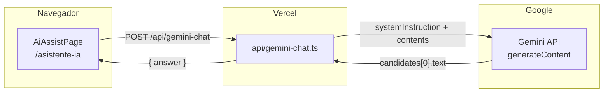

# Asistente IA con Gemini — Estructura y configuración

**Versión:** 1.0  
**Fecha:** Julio 2026  
**Proyecto:** Tablero Operativo  
**Alcance de este documento:** asesoría conversacional general (modos Agile/EOS y Logística). No cubre validación ni análisis de acciones del tablero.

---

## 1. Visión general

El asistente **IA O2C** es un chat de asesoría operativa integrado en la app. El usuario elige un **modo de enfoque**, conversa en español y recibe respuestas breves y accionables.

| Aspecto | Detalle |
|---------|---------|
| Ruta en la app | `/asistente-ia` (`ROUTES.AI_ASSIST`) |
| Entrada en menú | Sidebar → **IA O2C** |
| Backend en producción | Vercel Serverless → `api/gemini-chat.ts` |
| Proveedor de IA | Google Gemini API (`generativelanguage.googleapis.com`) |
| Modelo por defecto | `gemini-2.5-flash-lite` |
| Idioma de respuesta | Español |

### Modos disponibles

| ID | Título | Uso |
|----|--------|-----|
| `agile_eos_scalingup` | Asesor Agile, Scaling Up y EOS | Procesos, KPIs, OKRs, reuniones, accountability, scorecards, ejecución |
| `logistics` | Asesor en Logística y Operaciones | Rutas, almacenes, inventarios, distribución, KPIs logísticos, SOPs |

Cada modo define su propio **system prompt**, mensaje de bienvenida y **chips de sugerencia** iniciales.

---

## 2. Arquitectura



### Flujo de una pregunta

1. El usuario escribe en el panel de chat y envía (o usa un chip de sugerencia).
2. El frontend arma el historial `{ role, content }[]` y el `mode` activo.
3. Se hace `POST /api/gemini-chat` con `{ mode, messages }`.
4. Vercel valida el cuerpo, sanitiza mensajes y llama a Gemini con el system prompt del modo.
5. La respuesta se devuelve como `{ answer: string }` y se muestra en el chat.

**Seguridad:** la API key de Gemini (`GEMINI_API_KEY`) vive solo en Vercel. Nunca se expone al navegador.

---

## 3. Estructura de archivos

```
tablero-operativo/
├── api/
│   └── gemini-chat.ts              # Handler Vercel: prompts, sanitización, llamada a Gemini
├── src/
│   ├── constants/index.ts          # ROUTES.AI_ASSIST = '/asistente-ia'
│   ├── routes/index.tsx            # Ruta lazy de AiAssistPage
│   ├── lib/
│   │   └── assistantModes.ts       # Modos, títulos, welcome, sugerencias
│   ├── features/ai-support/
│   │   ├── index.ts                # Re-export de AiAssistPage
│   │   ├── types.ts                # AiChatMessage
│   │   └── pages/
│   │       └── AiAssistPage.tsx    # UI del chat y selector de modo
│   ├── components/layout/
│   │   └── Sidebar.tsx             # Enlace "IA O2C"
│   └── features/auth/lib/
│       └── permissions.ts          # Acceso por rol a /asistente-ia
├── docs/
│   ├── asistente-ia-gemini.md      # Este documento
│   └── vercel-env.md               # Variables GEMINI_* en Vercel
└── .env.example                    # Plantilla de GEMINI_* (solo referencia local)
```

### Responsabilidad por capa

| Archivo | Responsabilidad |
|---------|-----------------|
| `assistantModes.ts` | Metadatos de UI por modo (título, descripción, welcome, chips) |
| `AiAssistPage.tsx` | Estado del chat, selector de modo, envío a `/api/gemini-chat` |
| `api/gemini-chat.ts` | System prompts, límites, integración REST con Gemini |
| `types.ts` | Contrato mínimo de mensajes (`user` \| `assistant`) |

---

## 4. Configuración de entorno

### 4.1 Variables en Vercel (obligatorias para el asistente)

Configurar en **Vercel → Project → Settings → Environment Variables**:

| Variable | Requerida | Valor por defecto | Descripción |
|----------|-----------|-------------------|-------------|
| `GEMINI_API_KEY` | **Sí** | — | API key de [Google AI Studio](https://aistudio.google.com/) |
| `GEMINI_MODEL` | No | `gemini-2.5-flash-lite` | Modelo de Gemini |
| `GEMINI_MAX_TOKENS` | No | `700` | `maxOutputTokens` en `generationConfig` |
| `GEMINI_TEMPERATURE` | No | `0.25` | Temperatura de generación |
| `GEMINI_TIMEOUT_MS` | No | `20000` | Timeout de la petición HTTP a Gemini |

**Importante:** no usar `VITE_GEMINI_API_KEY`. Cualquier variable con prefijo `VITE_` se embebe en el bundle del navegador.

### 4.2 Valores recomendados en productivo

```
GEMINI_MODEL=gemini-2.5-flash-lite
GEMINI_MAX_TOKENS=700
GEMINI_TEMPERATURE=0.25
GEMINI_TIMEOUT_MS=20000
```

### 4.3 Desarrollo local

| Comando | Comportamiento |
|---------|----------------|
| `npm run dev` (solo Vite) | `/api/gemini-chat` **no existe** → 404 en el chat |
| `vercel dev` | Sirve Vite + funciones serverless; el asistente funciona si `GEMINI_API_KEY` está en `.env.local` |

Para probar el asistente en local, usar `vercel dev` o desplegar a un preview de Vercel.

---

## 5. Contrato de la API

### Endpoint

```
POST /api/gemini-chat
Content-Type: application/json
```

### Request (asesoría general)

```json
{
  "mode": "agile_eos_scalingup",
  "messages": [
    { "role": "user", "content": "Como estructuro mis KPIs y OKRs?" }
  ]
}
```

| Campo | Tipo | Requerido | Descripción |
|-------|------|-----------|-------------|
| `mode` | `"agile_eos_scalingup"` \| `"logistics"` | Sí | Modo de asesoría |
| `messages` | `AiChatMessage[]` | Sí | Historial de conversación |

### Response exitosa

```json
{
  "answer": "Diagnostico: ...\nRecomendacion: ...\nSiguiente accion: ..."
}
```

### Errores habituales

| HTTP | Causa típica |
|------|----------------|
| `400` | Modo inválido, mensajes vacíos o bloqueo de seguridad de Gemini |
| `404` | Endpoint no disponible (dev sin `vercel dev`) |
| `500` | Falta `GEMINI_API_KEY` o error interno |
| `502` | Gemini rechazó la solicitud o respuesta vacía |
| `503` | Rate limit de Gemini (429 upstream) |
| `504` | Timeout (`GEMINI_TIMEOUT_MS`) |

---

## 6. Límites y sanitización

Definidos en `api/gemini-chat.ts`:

| Límite | Valor | Dónde aplica |
|--------|-------|--------------|
| Mensajes enviados a Gemini | Últimos **8** | Servidor |
| Mensajes en estado del cliente | Últimos **24** | `AiAssistPage.tsx` |
| Caracteres por mensaje | **3 000** | Servidor |
| Tokens de salida | **700** (configurable) | `GEMINI_MAX_TOKENS` |

### Sanitización del servidor

- Filtra roles válidos (`user`, `assistant`) y contenido no vacío.
- Trunca mensajes largos.
- Mapea `assistant` → `model` (formato Gemini).
- Elimina `#` y `*` de la respuesta para texto plano legible.
- Si Gemini corta por `MAX_TOKENS`, añade nota al final de la respuesta.

---

## 7. System prompts (estructura)

Los prompts viven en `SYSTEM_PROMPTS` dentro de `api/gemini-chat.ts`. Cada modo sigue la misma plantilla:

### 7.1 Secciones del prompt

| Sección | Propósito |
|---------|-----------|
| Rol del asesor | Dominio experto (Agile/EOS o Logística) |
| **ALCANCE PERMITIDO** | Temas que sí responde |
| **FUERA DE ALCANCE** | Temas rechazados + mensaje de redirección |
| **REGLAS DE RESPUESTA** | Idioma, longitud, formato, tono |

### 7.2 Reglas de respuesta (ambos modos)

- Responder siempre en **español**.
- Máximo **~220 palabras** salvo que el usuario pida más detalle.
- **Sin Markdown** (`#`, `*` se eliminan en post-proceso).
- Etiquetas simples: `Diagnostico:`, `Recomendacion:`, `Siguiente accion:` (modo Agile) o `Problema detectado:`, `Causa probable:`, `KPI sugerido:` (modo Logística).
- No inventar datos ni prometer resultados garantizados.
- Rechazar temas fuera de alcance aunque el usuario insista.

### 7.3 Alcance permitido — `agile_eos_scalingup`

- Agile, Scrum, Kanban, Scrumban.
- Scaling Up: prioridades, reuniones, people, strategy, execution, cash.
- EOS: V/TO, Rocks, Scorecard, Issues List, Level 10, accountability chart.
- KPIs, OKRs, scorecards, tableros de control.
- Diagnóstico organizacional y mejora continua.

### 7.4 Alcance permitido — `logistics`

- Transporte, distribución, última milla, rutas.
- Almacenes, picking, packing, inventarios.
- Planeación de demanda, abastecimiento, capacidad.
- Costos logísticos, cuellos de botella, productividad.
- KPIs: OTIF, fill rate, lead time, rotación, merma, utilización de flota.
- SOPs, checklists operativos, mejora continua en logística.

### 7.5 Fuera de alcance (ambos modos)

Medicina, legal especializado, impuestos, inversiones, política, religión, programación profunda, hacking y contenido personal sensible.

---

## 8. Configuración en frontend

### 8.1 Modos (`src/lib/assistantModes.ts`)

```typescript
export type AssistantModeId = 'agile_eos_scalingup' | 'logistics'

export const assistantModes = [
  {
    id: 'agile_eos_scalingup',
    title: 'Asesor Agile, Scaling Up y EOS',
    description: '...',
    welcome: 'Hola, soy tu asesor...',
    suggestions: [
      'Como puedo mejorar mi seguimiento de acciones?',
      'Como estructuro mis KPIs y OKRs?',
      // ...
    ],
  },
  {
    id: 'logistics',
    title: 'Asesor en Logistica y Operaciones',
    // ...
  },
] as const
```

Para añadir un modo nuevo:

1. Agregar el `id` en `AssistantModeId` y en `assistantModes`.
2. Añadir el bloque `SYSTEM_PROMPTS[mode]` en `api/gemini-chat.ts`.
3. Actualizar `isAssistantMode()` en el handler.

### 8.2 Tipos de mensaje

```typescript
// src/features/ai-support/types.ts
export type AiChatMessage = {
  role: 'user' | 'assistant'
  content: string
}
```

### 8.3 Comportamiento de la UI (chat general)

| Acción | Efecto |
|--------|--------|
| Cambiar modo | Limpia historial y muestra nuevo `welcome` |
| Chip de sugerencia | Rellena el textarea con la pregunta |
| Enviar / Ctrl+Enter | Añade mensaje y llama a la API |
| Limpiar chat | Borra historial (mantiene modo activo) |
| Mensaje de bienvenida | Siempre visible como primer mensaje del asistente |

### 8.4 Permisos de acceso

La ruta `/asistente-ia` está permitida para todos los roles autenticados del tablero, incluido **Analista** (`permissions.ts`).

---

## 9. Integración con Gemini (detalle técnico)

### URL de la API

```
https://generativelanguage.googleapis.com/v1beta/models/{model}:generateContent?key={GEMINI_API_KEY}
```

### Payload enviado a Gemini

```json
{
  "systemInstruction": {
    "parts": [{ "text": "<SYSTEM_PROMPTS[mode]>" }]
  },
  "contents": [
    { "role": "user", "parts": [{ "text": "..." }] },
    { "role": "model", "parts": [{ "text": "..." }] }
  ],
  "generationConfig": {
    "maxOutputTokens": 700,
    "temperature": 0.25
  }
}
```

### Post-proceso de la respuesta

1. Extraer texto de `candidates[0].content.parts`.
2. Detectar `finishReason === 'MAX_TOKENS'` y añadir aviso.
3. Ejecutar `cleanAssistantText()` (quitar `#`, `*`, espacios extra).
4. Devolver `{ answer }` al cliente.

---

## 10. Despliegue y verificación

### Checklist de despliegue

- [ ] `GEMINI_API_KEY` configurada en Vercel (Production y Preview).
- [ ] Variables opcionales revisadas (`GEMINI_MODEL`, etc.).
- [ ] Redeploy tras cambiar variables de entorno.
- [ ] Probar `/asistente-ia` en ambos modos con una pregunta dentro de alcance.
- [ ] Probar una pregunta fuera de alcance (debe redirigir al dominio del asistente).

### Verificación rápida

1. Abrir **IA O2C** en la app desplegada.
2. Elegir modo **Agile, Scaling Up y EOS**.
3. Pulsar chip *"Como estructuro mis KPIs y OKRs?"* y enviar.
4. Confirmar respuesta en español, texto plano, con etiquetas estructuradas.

### Logs

Errores de Gemini se registran en los logs de Vercel con prefijo `Gemini API Error:` (status, model, reason).

---

## 11. Relación con otros stacks de IA del repo

Este proyecto también incluye Edge Functions de Supabase (`ai-chat`, `ai-chat-stream`, `ai-insights`, `ai-report`) que usan el gateway Lovable/OpenAI. **No son el backend del asistente `/asistente-ia`**.

| Stack | Uso actual del asistente IA O2C |
|-------|----------------------------------|
| **Vercel + Gemini** (`api/gemini-chat.ts`) | **Sí** — backend activo del chat en `/asistente-ia` |
| Supabase Edge Functions + Lovable | No conectado a `AiAssistPage` hoy |

Para documentación del stack O2C con Edge Functions, ver [ia.md](./ia.md) y [lovable-ai-edge-function.md](./lovable-ai-edge-function.md).

---

## 12. Referencias

| Recurso | Ubicación |
|---------|-----------|
| Handler Vercel | `api/gemini-chat.ts` |
| Modos y sugerencias | `src/lib/assistantModes.ts` |
| Página del asistente | `src/features/ai-support/pages/AiAssistPage.tsx` |
| Variables en Vercel | `docs/vercel-env.md` |
| Plantilla `.env` | `.env.example` (sección GEMINI_*) |
| Google AI Studio | https://aistudio.google.com/ |
| Gemini API REST | https://ai.google.dev/gemini-api/docs |
