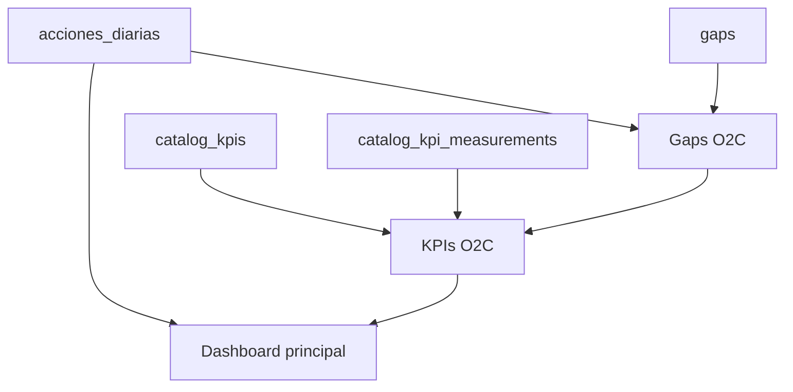

# Dashboard y KPIs

Este documento explica la **estructura** y el **funcionamiento** de los dashboards relacionados con operación, KPIs y gaps dentro del tablero operativo.

---

## Visión general

Hoy el producto tiene **tres vistas principales** conectadas entre sí:

1. **Dashboard principal**
   Muestra el pulso operativo del día: métricas rápidas, control de acciones, score global O2C y semáforo KPI.
2. **Dashboard de KPIs O2C**
   Muestra el detalle analítico del portafolio de KPIs: score global, filtros, semáforo y tarjetas por indicador.
3. **Dashboard de Gaps O2C**
   Muestra las brechas operativas, su avance por story points y el resumen de KPIs vinculados a cada gap.

En rutas:

- `ROUTES.DASHBOARD` -> `DashboardPage`
- `ROUTES.DASHBOARD_KPIS` -> `KpisDashboardPage`
- `ROUTES.DASHBOARD_GAPS` -> `GapsDashboardPage`

---

## Cómo se relacionan

- El **dashboard principal** es la vista ejecutiva del día.
- El **dashboard de KPIs** profundiza en el desempeño de los indicadores de catálogo O2C.
- El **dashboard de gaps** profundiza en la ejecución de las brechas operativas.
- Los **gaps** y los **KPIs** pueden estar relacionados por `gap_id`.
- Las **acciones** se vinculan al seguimiento operativo y pueden apuntar a un `gap_id` y opcionalmente a un `catalog_kpi_id`.

Regla importante del producto:

- **Las acciones no recalculan automáticamente una medición KPI de catálogo.**
- El **gap** refleja avance operativo.
- El **KPI** refleja medición explícita y cumplimiento.

---

## Estructura del dashboard principal

La página `DashboardPage` arma la vista en este orden:

1. **Header**
   Contiene acciones globales como expandir/colapsar filtros y crear una acción.
2. **Barra de filtros**
   Usa `KanbanToolbar` y filtra principalmente por fecha y criterios operativos.
3. **Tarjetas KPI del día**
   Usa `DashboardKpiCards` y resume métricas operativas inmediatas.
4. **Bloque de score global O2C**
   Muestra el score ponderado del portafolio y su evolución histórica.
5. **Control de acciones**
   Tabla principal de acciones del día, con edición desde la propia vista.
6. **Semáforo KPI**
   Resume el estado de los KPIs de catálogo O2C.

### Métricas del día

Las tarjetas del dashboard principal salen de `metricasFromAcciones()` y calculan:

- `total`: acciones visibles con el filtro actual
- `completadas`: acciones en `Hecho` o `Verificado`
- `bloqueadas`: acciones en `Bloqueado`
- `sinEvidencia`: acciones cerradas sin evidencia cargada
- `eficienciaPorcentaje`: `completadas / total`

Estas métricas son operativas y dependen de `useAcciones(filter)`.

### Score global O2C

El bloque ejecutivo de score usa `useO2cGlobalScore()`, que a su vez reutiliza un pipeline común para:

- leer KPIs O2C activos
- resolver su última medición
- calcular cumplimiento y semáforo
- calcular el score global ponderado

Además muestra una gráfica histórica con snapshots del score global.

Detalle de escala (0–1 en BD vs % en UI), snapshots, RPC y reglas de negocio: [global-score-evolution.md](./global-score-evolution.md).

### Control de acciones

El bloque `DashboardActionsSection` usa:

- `useAcciones(filter)`
- `useCommentCounts(accionIds)`
- `useChecklistProgressByAccionIds(accionIds)`
- `useUsers({ activo: true })`

Su objetivo es cruzar ejecución diaria con contexto operativo:

- responsables
- comentarios
- avance de checklist
- edición de acciones desde el modal `AccionFormDialog`

### Semáforo KPI

El semáforo del dashboard principal usa `CatalogKpiSemaforoGrid`.

Cada tarjeta muestra:

- nombre del KPI
- porcentaje de cumplimiento
- color del semáforo
- umbrales aplicados
- conteo de acciones vinculadas como impacto operativo

---

## Estructura del dashboard de KPIs

La página `KpisDashboardPage` está pensada para análisis más profundo del portafolio.

Se organiza así:

1. **Encabezado ejecutivo**
   Explica que la vista trabaja con KPIs de catálogo O2C.
2. **Aviso de pesos**
   Si la suma del portafolio global no es aproximadamente 1, se muestra advertencia.
3. **Salud global del portafolio**
   Incluye score global, breakdown por semáforo y evolución histórica.
4. **Filtros y orden**
   Permiten filtrar por horizonte, área, responsable y estado.
5. **Semáforo por KPI**
   Muestra los indicadores ya filtrados.
6. **Detalle de KPIs**
   Tarjetas con información más completa por indicador.

### Filtros disponibles

- Horizonte de meta: `M6`, `M12`, `M18`
- Área del gap
- Responsable del KPI
- Estado de cumplimiento
- Orden por nombre, porcentaje, peso, área o estado

### Qué muestra cada KPI

Cada tarjeta de KPI puede incluir:

- nombre del indicador
- gap relacionado
- responsable
- peso
- valor actual
- meta efectiva
- cumplimiento
- tendencia contra mediciones recientes
- estado de semáforo

---

## Cómo funcionan los KPIs O2C

Los KPIs modernos del tablero salen de **`catalog_kpis`** y sus mediciones de **`catalog_kpi_measurements`**.

No deben confundirse con el modelo legacy de `kpis` / `kpi_mediciones`.

### Fuente del valor actual

Para cada KPI, el valor actual se resuelve con esta prioridad:

1. **Última medición** registrada
2. `current_value` en catálogo
3. `baseline` como respaldo

Esto permite que el KPI siga teniendo un punto de partida aun si todavía no hay una medición reciente.

### Cómo se calcula el cumplimiento

La lógica vive en `kpiCalculations.ts`.

El cálculo usa:

- `baseline`
- meta efectiva (`target_m6`, `target_m12`, `target_m18`)
- `current`
- `calc_type`

Tipos de cálculo:

- `maximize`: más alto es mejor
- `minimize`: más bajo es mejor
- `binary`: cumple o no cumple

### Cómo se elige la meta

El horizonte puede ser:

- `m6`
- `m12`
- `m18`

Si falta una meta intermedia, se aplica fallback hacia horizontes posteriores. La política actual por defecto es **`M18`**.

### Cómo se determina el semáforo

El estado de cumplimiento se clasifica como:

- `on_track`
- `at_risk`
- `off_track`

Se usan umbrales por KPI si existen; si no, se aplican defaults:

- verde: `>= 85%`
- amarillo: `>= 65%`
- rojo: `< 65%`

### Cómo se calcula el score global

El score global se calcula como **media ponderada** de los KPIs elegibles del portafolio:

- KPI activo
- con `gap_id`
- marcado en `in_global_portfolio`
- con peso válido
- con cumplimiento calculable

Fórmula conceptual:

`sum(weight * compliance) / sum(weight)`

La vista también calcula:

- suma total de pesos
- advertencia si la suma no es aproximadamente `1`
- cobertura efectiva del score
- breakdown de KPIs en meta, riesgo, fuera de meta y sin datos

---

## Estructura del dashboard de gaps

La página `GapsDashboardPage` complementa la vista de KPIs porque traduce indicadores a ejecución operativa.

Se compone de:

1. **Header del módulo**
2. **Filtros y orden**
3. **Resumen de estado**
4. **Tarjetas de brecha**

Cada gap muestra:

- nombre y estado
- responsable
- avance por story points
- cantidad de acciones relacionadas
- KPIs vinculados
- peso agregado del gap
- resumen de semáforo de sus KPIs

### Cómo se calcula el avance del gap

La lógica vive en `computeGapStoryProgress()`.

El avance usa:

- acciones con `gap_id = gap.id`
- acciones ligadas por tabla puente `accion_gaps`
- story points en estado `Hecho` o `Verificado`

Si no hay story points en acciones, puede usarse `total_story_points` del gap como denominador de respaldo.

---

## Flujo de datos resumido

Lectura práctica:

- `acciones_diarias` alimenta métricas operativas y avance de gaps
- `gaps` organiza la ejecución por brechas
- `catalog_kpis` y `catalog_kpi_measurements` alimentan cumplimiento, semáforo y score global
- el dashboard principal consume un resumen de ambos mundos

---

## Estructura técnica por capas

En frontend, el patrón general es:

- **Rutas** en `src/routes`
- **Pages** como contenedores de pantalla
- **Components** para bloques visuales
- **Hooks** para consulta y composición de datos
- **Utils** para reglas de cálculo

Para esta zona del producto:

- `src/pages/dashboard/`
  Contenedor del dashboard principal
- `src/features/kpi/pages/`
  Pantallas de KPIs y gaps
- `src/features/kpi/hooks/`
  Pipeline de cálculo y lectura de métricas
- `src/features/kpi/utils/`
  Reglas de cumplimiento, score y progreso
- `src/features/operations/`
  Datos operativos de acciones

---

## Resumen ejecutivo

- El **dashboard principal** combina operación diaria + score global + semáforo KPI.
- El **dashboard de KPIs** es la vista analítica del portafolio O2C.
- El **dashboard de gaps** es la vista de ejecución de brechas.
- Los **KPIs** se calculan desde catálogo + mediciones, no desde cierres de acciones.
- Las **acciones** sí impactan el avance de gaps y el contexto operativo mostrado en dashboard.
